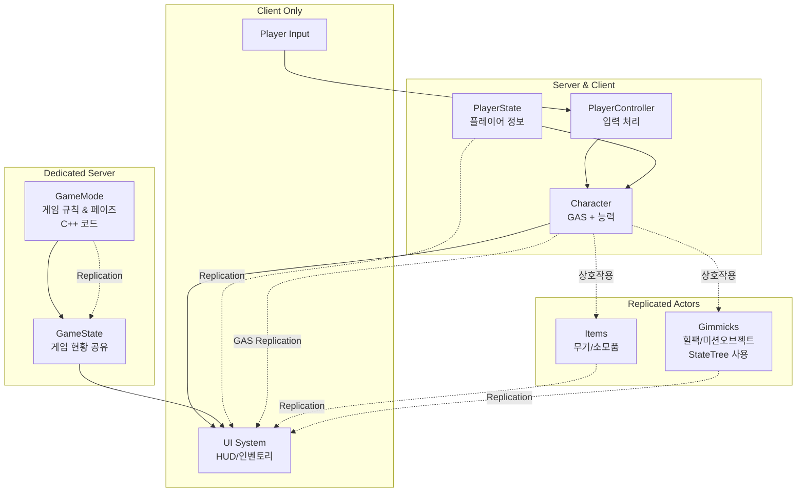
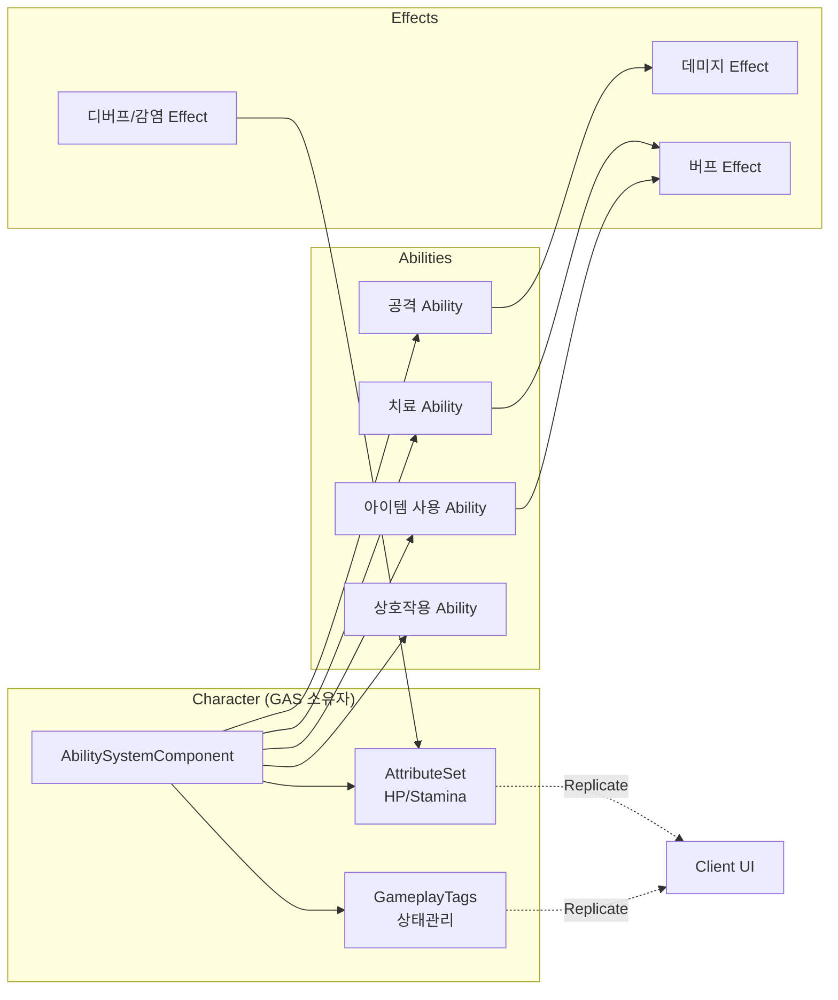
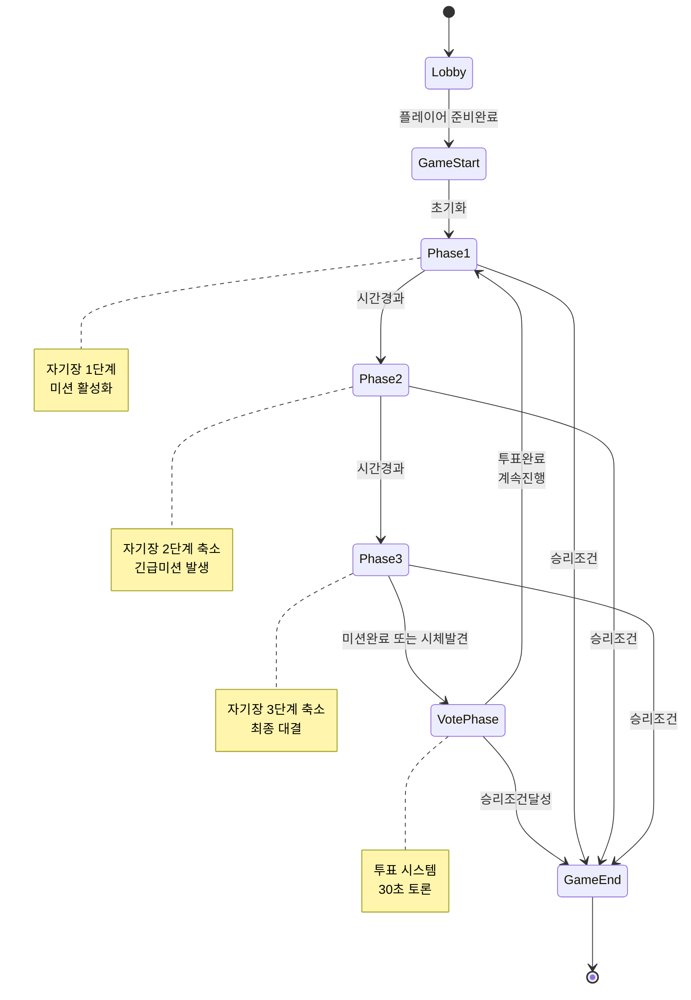
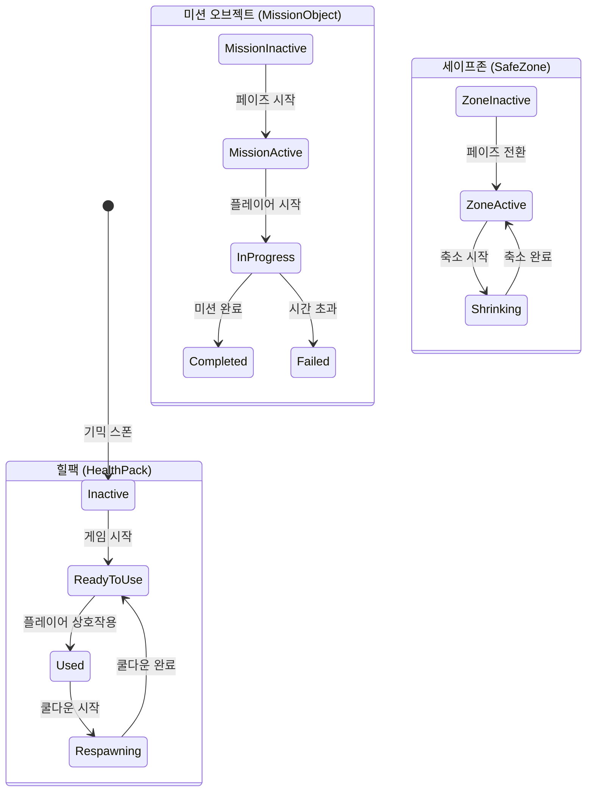
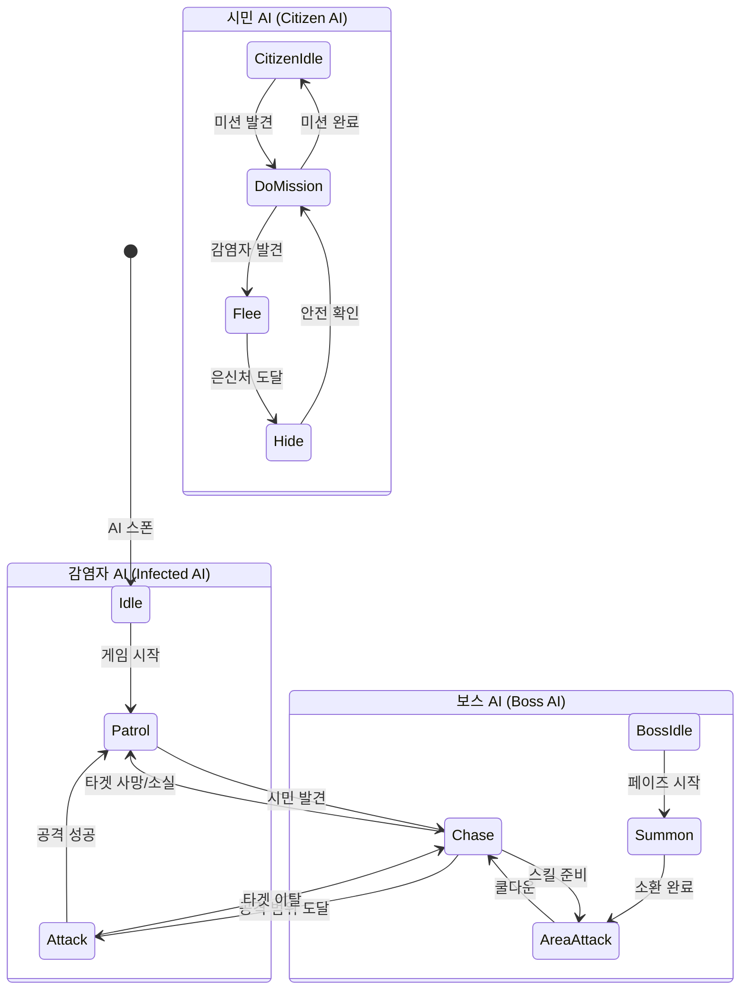
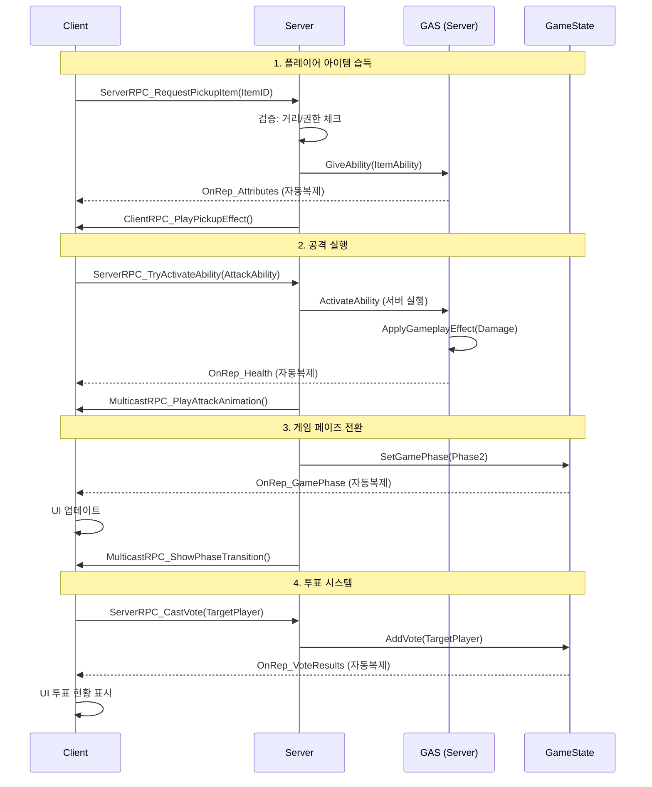
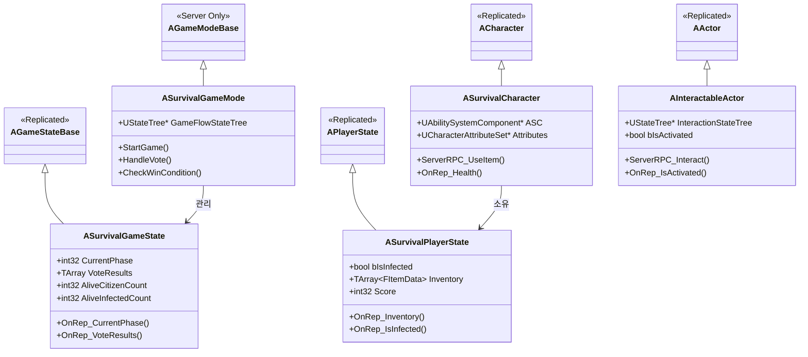
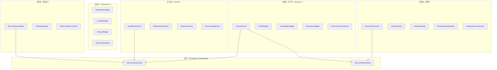
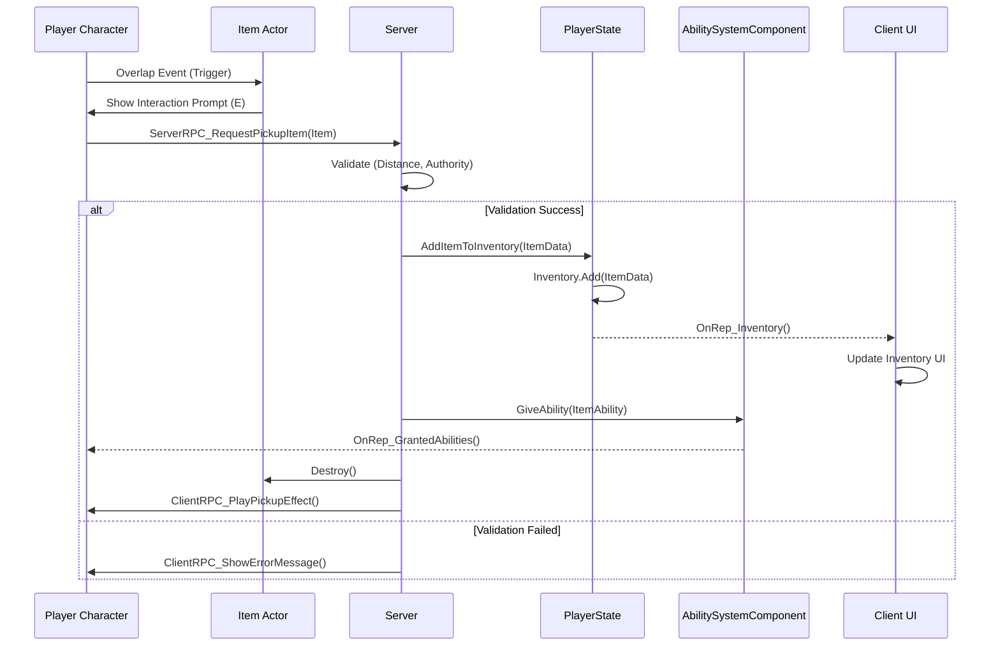

# 데디서버 멀티플레이어 게임 프로젝트 구조

## 1. 전체 시스템 아키텍처



## 2. GAS (Gameplay Ability System) 구조



## 3. 게임 페이즈 흐름 (GameMode - C++ 코드로 구현)

> **참고**: 게임 페이즈는 State Tree 대신 **C++ 코드**로 구현합니다. State Tree는 Gimmick에만 사용합니다.



## 3-1. State Tree 구조 (Gimmick & AI)

> State Tree는 **Gimmick**과 **AI 행동** 관리에 사용합니다. (Behavior Tree 대체)



## 3-2. AI State Tree 구조

> UE 5.6에서는 **Behavior Tree 대신 State Tree**를 AI에 사용합니다.



## 4. 네트워크 아키텍처 (서버-클라이언트 통신)



## 5. 클래스 상속 구조



## 6. 역할별 담당 클래스 매핑



## 7. 데이터 흐름 (아이템 획득 예시)



## 8. 폴더 구조

```
Source/
├── SurvivalGame/
│   ├── Characters/
│   │   ├── SurvivalCharacter.h/cpp
│   │   ├── CitizenCharacter.h/cpp
│   │   └── InfectedCharacter.h/cpp
│   ├── GAS/
│   │   ├── Abilities/
│   │   │   ├── GA_Attack.h/cpp
│   │   │   ├── GA_Heal.h/cpp
│   │   │   ├── GA_UseItem.h/cpp
│   │   │   └── GA_Interact.h/cpp
│   │   ├── Attributes/
│   │   │   └── CharacterAttributeSet.h/cpp
│   │   ├── Effects/
│   │   │   ├── GE_Damage.h/cpp
│   │   │   ├── GE_Heal.h/cpp
│   │   │   └── GE_Infection.h/cpp
│   │   └── AbilitySystemComponent/
│   │       └── SurvivalASC.h/cpp
│   ├── GameModes/
│   │   ├── SurvivalGameMode.h/cpp
│   │   ├── MenuGameMode.h/cpp
│   │   └── LobbyGameMode.h/cpp
│   ├── GameStates/
│   │   └── SurvivalGameState.h/cpp
│   ├── PlayerStates/
│   │   └── SurvivalPlayerState.h/cpp
│   ├── PlayerControllers/
│   │   └── SurvivalPlayerController.h/cpp
│   ├── AI/
│   │   ├── SurvivalAIController.h/cpp
│   │   ├── InfectedAIController.h/cpp
│   │   ├── CitizenAIController.h/cpp
│   │   └── Components/
│   │       ├── AIPerceptionComponent.h/cpp
│   │       └── AIStateTreeComponent.h/cpp
│   ├── StateTrees/
│   │   ├── Gimmicks/
│   │   │   ├── ST_HealthPack (Asset)
│   │   │   ├── ST_MissionObject (Asset)
│   │   │   └── ST_SafeZone (Asset)
│   │   ├── AI/
│   │   │   ├── ST_InfectedAI (Asset)
│   │   │   ├── ST_CitizenAI (Asset)
│   │   │   └── ST_BossAI (Asset)
│   │   └── Tasks/
│   │       ├── ST_ActivateGimmick.h/cpp
│   │       ├── STTask_Patrol.h/cpp
│   │       ├── STTask_Chase.h/cpp
│   │       ├── STTask_Attack.h/cpp
│   │       └── STTask_Flee.h/cpp
│   ├── Items/
│   │   ├── ItemBase.h/cpp
│   │   ├── WeaponItem.h/cpp
│   │   └── ConsumableItem.h/cpp
│   ├── Gimmicks/
│   │   ├── HealthPackActor.h/cpp
│   │   ├── MissionObjectActor.h/cpp
│   │   └── SafeZoneActor.h/cpp
│   ├── UI/
│   │   ├── InGame/
│   │   │   ├── InGameHUD.h/cpp
│   │   │   ├── ChatWidget.h/cpp
│   │   │   ├── HealthBarWidget.h/cpp
│   │   │   └── InventoryWidget.h/cpp
│   │   └── OutGame/
│   │       ├── MainMenuWidget.h/cpp
│   │       ├── LobbyWidget.h/cpp
│   │       └── ResultWidget.h/cpp
│   └── Online/
│       ├── SurvivalGameInstance.h/cpp
│       ├── VoiceChatComponent.h/cpp
│       └── VotingSystem.h/cpp
```

---
